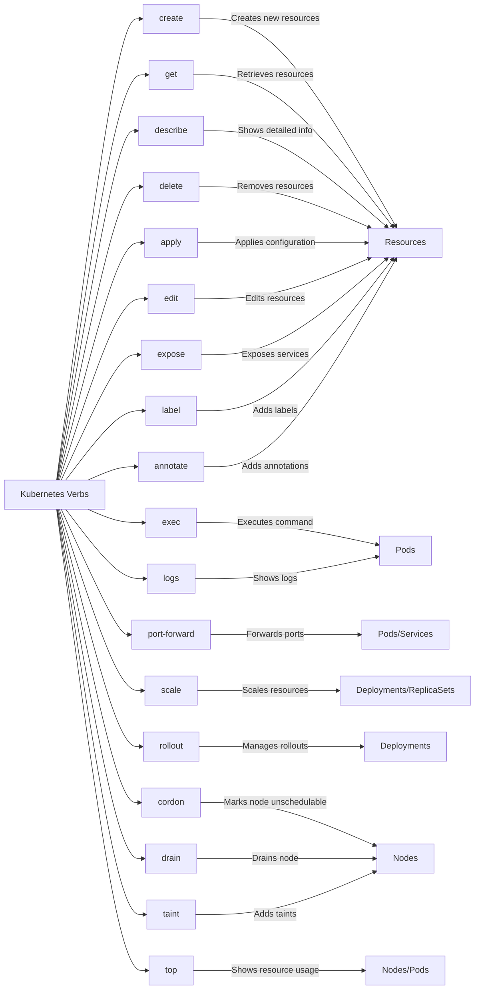

# Kubectl Command Reference

This document contains useful kubectl commands and their descriptions for CKAD exam preparation.

## Resource Management

### `kubectl api-resources`
Lists all available API resources in the cluster.

#### Common Usage:
```bash
# List all API resources
kubectl api-resources

# List API resources with their short names
kubectl api-resources --namespaced=true

# List API resources with their API versions
kubectl api-resources -o wide
```

#### Key Points:
- Shows all available resource types in the cluster
- Displays resource names, short names, API group, namespaced status, and kind
- Useful for discovering available resources and their short names
- Helpful for understanding which resources are namespaced vs cluster-scoped

#### Example Output:
```
NAME                              SHORTNAMES   APIVERSION                        NAMESPACED   KIND
configmaps                        cm           v1                                true         ConfigMap
deployments                       deploy       apps/v1                           true         Deployment
namespaces                        ns           v1                                false        Namespace
pods                              po           v1                                true         Pod
```

#### Tips:
- Use `--namespaced=true` to filter for namespaced resources only
- Use `-o wide` to see additional details like API versions
- Remember short names (e.g., `po` for pods) for faster command execution during the exam

### `kubectl describe`
Displays detailed information about a specific resource or group of resources.

#### Common Usage:
```bash
# Describe a specific PVC
kubectl describe pvc my-claim

# Describe a pod
kubectl describe pod my-pod

# Describe all pods in a namespace
kubectl describe pods

# Describe a resource in a specific namespace
kubectl describe pod my-pod -n my-namespace
```

#### Key Points:
- Provides detailed information about a resource's configuration and current state
- Shows events related to the resource
- Displays resource specifications and status
- Useful for troubleshooting and understanding resource details

#### Example Output (for PVC):
```
Name:          my-claim
Namespace:     default
StorageClass:  standard
Status:        Bound
Volume:        pvc-12345678-90ab-cdef-0123-456789abcdef
Labels:        <none>
Annotations:   pv.kubernetes.io/bind-completed: yes
               pv.kubernetes.io/bound-by-controller: yes
Finalizers:    [kubernetes.io/pvc-protection]
Capacity:      1Gi
Access Modes:  RWO
VolumeMode:    Filesystem
Mounted By:    my-pod
Events:
  Type    Reason                 Age   From                         Message
  ----    ------                 ----  ----                         -------
  Normal  ProvisioningSucceeded  2m    persistentvolume-controller  Successfully provisioned volume pvc-12345678-90ab-cdef-0123-456789abcdef
```

#### Tips:
- Use the short name `kd` if you've set up the alias
- Can be used with any resource type (pods, services, deployments, etc.)
- Events section is particularly useful for troubleshooting
- Use `-n` flag to specify namespace when needed
- Can describe multiple resources of the same type at once 

## Kubectl Verbs

### Common Verbs


### Verb Usage Examples

1. **create**
   - Creates a new resource from a file or stdin
   - Examples:
     ```bash
     # Create from file
     kubectl create -f pod.yaml
     
     # Create from stdin
     cat pod.yaml | kubectl create -f -
     
     # Create namespace
     kubectl create namespace my-namespace
     ```

2. **get**
   - Lists and displays resources
   - Examples:
     ```bash
     # List all pods
     kubectl get pods
     
     # List pods in specific namespace
     kubectl get pods -n my-namespace
     
     # Get specific pod
     kubectl get pod my-pod
     
     # Get with wide output
     kubectl get pods -o wide
     ```

3. **describe**
   - Shows detailed information about resources
   - Examples:
     ```bash
     # Describe a pod
     kubectl describe pod my-pod
     
     # Describe a service
     kubectl describe service my-service
     
     # Describe all pods in namespace
     kubectl describe pods -n my-namespace
     ```

4. **delete**
   - Removes resources from the cluster
   - Examples:
     ```bash
     # Delete a pod
     kubectl delete pod my-pod
     
     # Delete using file
     kubectl delete -f pod.yaml
     
     # Delete all pods in namespace
     kubectl delete pods --all -n my-namespace
     
     # Force delete
     kubectl delete pod my-pod --force --grace-period=0
     ```

5. **apply**
   - Applies configuration to resources
   - Examples:
     ```bash
     # Apply configuration from file
     kubectl apply -f deployment.yaml
     
     # Apply configuration from stdin
     cat deployment.yaml | kubectl apply -f -
     
     # Apply with force
     kubectl apply -f deployment.yaml --force
     ```

6. **edit**
   - Edits resources
   - Examples:
     ```bash
     # Edit deployment
     kubectl edit deployment my-deployment
     
     # Edit with specific editor
     KUBE_EDITOR="nano" kubectl edit deployment my-deployment
     ```

7. **exec**
   - Executes command in container
   - Examples:
     ```bash
     # Execute command in pod
     kubectl exec my-pod -- ls /var/log
     
     # Execute interactive shell
     kubectl exec -it my-pod -- /bin/bash
     
     # Execute in specific container
     kubectl exec -it my-pod -c my-container -- /bin/bash
     ```

8. **logs**
   - Shows container logs
   - Examples:
     ```bash
     # Show pod logs
     kubectl logs my-pod
     
     # Show logs with follow
     kubectl logs -f my-pod
     
     # Show logs for specific container
     kubectl logs my-pod -c my-container
     
     # Show logs with timestamps
     kubectl logs my-pod --timestamps
     ```

9. **port-forward**
   - Forwards ports to pod or service
   - Examples:
     ```bash
     # Forward to pod
     kubectl port-forward my-pod 8080:80
     
     # Forward to service
     kubectl port-forward svc/my-service 8080:80
     
     # Forward to deployment
     kubectl port-forward deployment/my-deployment 8080:80
     ```

10. **expose**
    - Exposes resources as services
    - Examples:
      ```bash
      # Expose deployment
      kubectl expose deployment my-deployment --port=80 --target-port=8080
      
      # Expose with type
      kubectl expose deployment my-deployment --type=LoadBalancer
      
      # Expose with name
      kubectl expose deployment my-deployment --name=my-service
      ```