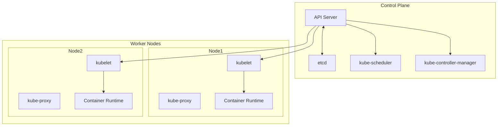
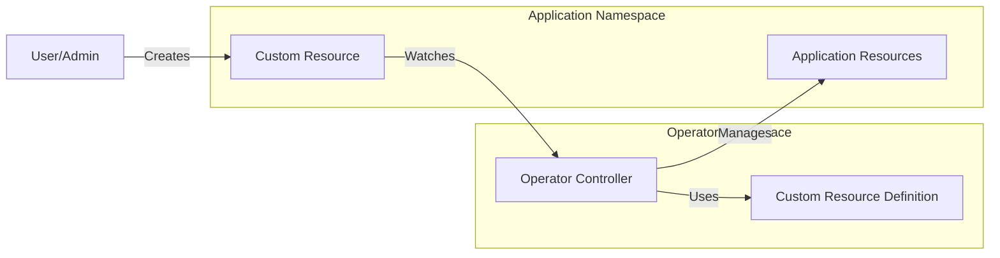
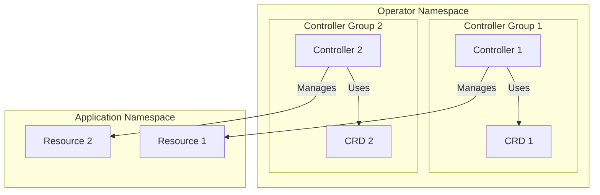
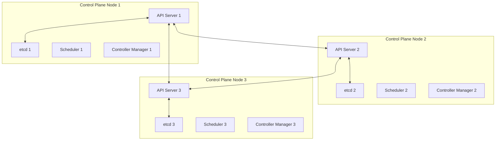
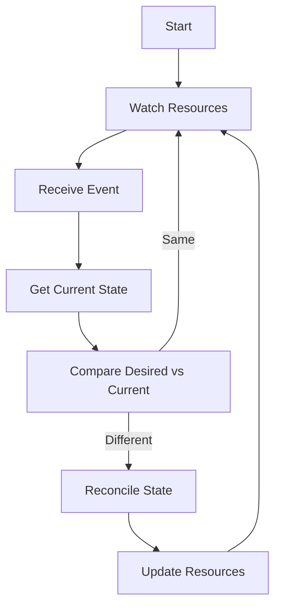

# Kubernetes Architecture and Components

## Cluster Architecture Diagram


## Custom Controller Architecture


## Cluster Components

### Control Plane Components
1. **kube-apiserver**
   - Exposes the Kubernetes API
   - Front-end for the control plane
   - Handles REST operations and validation

2. **etcd**
   - Consistent and highly-available key value store
   - Stores all cluster data
   - Backbone of the cluster state

3. **kube-scheduler**
   - Watches for newly created Pods with no assigned node
   - Selects a node for the Pod to run on
   - Considers resource requirements, hardware/software constraints, etc.

4. **kube-controller-manager**
   - Runs controller processes
   - Includes Node Controller, Replication Controller, Endpoints Controller, etc.
   - Each controller is a separate process but compiled into a single binary

### Node Components
1. **kubelet**
   - Agent that runs on each node
   - Ensures containers are running in a Pod
   - Takes PodSpecs and ensures containers are running and healthy

2. **kube-proxy**
   - Network proxy that runs on each node
   - Maintains network rules on nodes
   - Allows network communication to Pods

3. **Container Runtime**
   - Software responsible for running containers
   - Examples: containerd, CRI-O, Docker Engine

## Custom Controllers and Operators

### Where Custom Controllers Run
Custom controllers typically run as Pods in the cluster, usually in one of these locations:

1. **kube-system namespace**
   - For system-level controllers
   - Requires cluster-admin privileges
   - Example: cloud provider controllers

2. **Custom namespace**
   - For application-specific controllers
   - Example: `custom-controllers` or application-specific namespace
   - Requires appropriate RBAC permissions

### Operator Pattern
Operators are a method of packaging, deploying, and managing a Kubernetes application. They run as custom controllers and typically:

1. **Deployment Location**
   - Run in their own namespace (e.g., `operator-system`)
   - Deployed as a Deployment for high availability
   - Use leader election for multiple replicas

2. **Example Operator Deployment**
```yaml
apiVersion: apps/v1
kind: Deployment
metadata:
  name: my-operator
  namespace: operator-system
spec:
  replicas: 1
  selector:
    matchLabels:
      app: my-operator
  template:
    metadata:
      labels:
        app: my-operator
    spec:
      serviceAccountName: operator-sa
      containers:
      - name: operator
        image: my-operator:v1
```

3. **Key Characteristics**
   - Use Custom Resource Definitions (CRDs)
   - Implement control loops
   - Handle application lifecycle
   - Can be created using Operator SDK or Kubebuilder

### Controller Architecture
1. **Control Loop**
   - Watch for changes to resources
   - Compare desired state with current state
   - Take action to reconcile differences

2. **RBAC Requirements**
   - Need permissions to watch and modify resources
   - ServiceAccount with appropriate ClusterRoles
   - Example:
```yaml
apiVersion: rbac.authorization.k8s.io/v1
kind: ClusterRole
metadata:
  name: operator-role
rules:
- apiGroups: ["apps"]
  resources: ["deployments"]
  verbs: ["get", "list", "watch", "create", "update", "patch", "delete"]
```

3. **High Availability**
   - Deploy multiple replicas
   - Use leader election
   - Handle failover gracefully

## Best Practices for Custom Controllers
1. Use appropriate namespaces
2. Implement proper RBAC
3. Include health checks
4. Add metrics and logging
5. Handle graceful shutdown
6. Use leader election for HA
7. Implement proper error handling
8. Add comprehensive testing

## Managing Multiple Controllers and CRDs

### Controller Organization


### Best Practices for Multiple Controllers

1. **Namespace Organization**
   - Group related controllers in the same namespace
   - Use separate namespaces for different domains
   - Example structure:
     ```
     operator-system/
     ├── database-operators/
     ├── monitoring-operators/
     └── networking-operators/
     ```

2. **Controller Grouping**
   - Group controllers by domain or functionality
   - Use a single controller for related CRDs
   - Implement controller hierarchies when needed

3. **Resource Management**
   - Use finalizers to prevent orphaned resources
   - Implement proper cleanup procedures
   - Handle resource dependencies correctly

4. **Communication Between Controllers**
   - Use Kubernetes events for cross-controller communication
   - Implement watch mechanisms for related resources
   - Use annotations for cross-controller coordination

5. **Example Multi-Controller Setup**
```yaml
# Controller Group Deployment
apiVersion: apps/v1
kind: Deployment
metadata:
  name: database-operators
  namespace: operator-system
spec:
  replicas: 1
  selector:
    matchLabels:
      app: database-operators
  template:
    metadata:
      labels:
        app: database-operators
    spec:
      serviceAccountName: database-operator-sa
      containers:
      - name: postgres-operator
        image: postgres-operator:v1
      - name: redis-operator
        image: redis-operator:v1
```

6. **RBAC Organization**
   - Create separate ClusterRoles for each controller group
   - Use RoleBindings for namespace-scoped permissions
   - Implement least privilege principle

7. **Monitoring and Observability**
   - Use consistent labeling across controllers
   - Implement shared metrics endpoints
   - Centralize logging for all controllers

8. **Version Management**
   - Version CRDs independently
   - Maintain backward compatibility
   - Use conversion webhooks for CRD version changes

9. **Error Handling**
   - Implement retry mechanisms
   - Use exponential backoff
   - Maintain error state in status fields

10. **Testing Strategy**
    - Test controllers in isolation
    - Implement integration tests for controller interactions
    - Use end-to-end tests for complete workflows

## Control Plane Deployment

### Control Plane Node Architecture


### Control Plane Deployment Models

1. **Single Control Plane**
   - All control plane components run on a single node
   - Suitable for development and testing
   - Not recommended for production
   - Single point of failure

2. **High Availability Control Plane**
   - Multiple control plane nodes (typically 3 or 5)
   - Components distributed across nodes
   - etcd runs in a quorum (odd number of nodes)
   - Load balancer in front of API servers

3. **Cloud Provider Managed**
   - Control plane managed by cloud provider
   - Automatic scaling and maintenance
   - High availability built-in
   - Examples: EKS, GKE, AKS

### Control Plane Components Distribution

1. **API Server**
   - Runs on all control plane nodes
   - Stateless - can be scaled horizontally
   - Load balanced for high availability
   - Handles all API requests

2. **etcd**
   - Distributed across control plane nodes
   - Requires odd number of nodes (3, 5, 7)
   - Uses Raft consensus algorithm
   - Critical for cluster state management

3. **Controller Manager**
   - Runs on all control plane nodes
   - Uses leader election
   - Only one active instance at a time
   - Others in standby mode

4. **Scheduler**
   - Runs on all control plane nodes
   - Uses leader election
   - Only one active instance at a time
   - Others in standby mode

### High Availability Considerations

1. **Node Requirements**
   - Minimum 3 nodes for production
   - Odd number of nodes for etcd quorum
   - Sufficient resources for all components
   - Network connectivity between nodes

2. **Load Balancing**
   - External load balancer for API servers
   - Health checks for component availability
   - Session affinity configuration
   - SSL/TLS termination

3. **Failure Scenarios**
   - Node failure handling
   - Network partition recovery
   - etcd data consistency
   - Component restart procedures

4. **Maintenance Procedures**
   - Rolling updates for control plane
   - etcd backup and restore
   - Certificate rotation
   - Version upgrades 

## Controller Reconciliation Loop

### Reconciliation Loop Pattern


### Reconciliation Loop Components

1. **Watch Phase**
   - Continuously monitors Kubernetes resources
   - Uses informers for efficient watching
   - Caches resource state locally
   - Example:
   ```go
   informer := cache.NewSharedIndexInformer(
       &cache.ListWatch{
           ListFunc: func(options metav1.ListOptions) (runtime.Object, error) {
               return client.CoreV1().Pods(namespace).List(context.TODO(), options)
           },
           WatchFunc: func(options metav1.ListOptions) (watch.Interface, error) {
               return client.CoreV1().Pods(namespace).Watch(context.TODO(), options)
           },
       },
       &v1.Pod{},
       0,
       cache.Indexers{},
   )
   ```

2. **Event Handling**
   - Processes ADD, UPDATE, DELETE events
   - Filters relevant events
   - Queues events for processing
   - Example event types:
     ```go
     type EventType string
     const (
         Added    EventType = "ADDED"
         Modified EventType = "MODIFIED"
         Deleted  EventType = "DELETED"
     )
     ```

3. **State Comparison**
   - Retrieves current state from cluster
   - Compares with desired state
   - Identifies differences
   - Example comparison:
   ```go
   func (r *Reconciler) compareStates(desired, current *v1.Pod) bool {
       return desired.Spec.Containers[0].Image == current.Spec.Containers[0].Image
   }
   ```

4. **Reconciliation Logic**
   - Implements business logic
   - Makes necessary changes
   - Handles errors and retries
   - Example reconciliation:
   ```go
   func (r *Reconciler) reconcile(ctx context.Context, req ctrl.Request) (ctrl.Result, error) {
       // Get current state
       pod := &v1.Pod{}
       if err := r.Get(ctx, req.NamespacedName, pod); err != nil {
           return ctrl.Result{}, err
       }

       // Compare with desired state
       if needsUpdate(pod) {
           // Make changes
           if err := r.Update(ctx, pod); err != nil {
               return ctrl.Result{}, err
           }
       }

       return ctrl.Result{}, nil
   }
   ```

### Best Practices for Reconciliation

1. **Idempotency**
   - Operations should be safe to repeat
   - Same input should produce same output
   - Handle partial failures gracefully
   - Example:
   ```go
   func (r *Reconciler) ensureDeployment(ctx context.Context, desired *appsv1.Deployment) error {
       current := &appsv1.Deployment{}
       err := r.Get(ctx, client.ObjectKeyFromObject(desired), current)
       if apierrors.IsNotFound(err) {
           return r.Create(ctx, desired)
       }
       if err != nil {
           return err
       }
       return r.Update(ctx, desired)
   }
   ```

2. **Rate Limiting**
   - Implement backoff for retries
   - Use exponential backoff
   - Set maximum retry attempts
   - Example:
   ```go
   func (r *Reconciler) SetupWithManager(mgr ctrl.Manager) error {
       return ctrl.NewControllerManagedBy(mgr).
           For(&v1.Pod{}).
           WithOptions(controller.Options{
               MaxConcurrentReconciles: 1,
               RateLimiter: workqueue.NewItemExponentialFailureRateLimiter(
                   time.Millisecond*100,
                   time.Second*10,
               ),
           }).
           Complete(r)
   }
   ```

3. **Error Handling**
   - Log errors appropriately
   - Implement retry logic
   - Update status fields
   - Example:
   ```go
   func (r *Reconciler) handleError(ctx context.Context, err error, obj client.Object) (ctrl.Result, error) {
       if apierrors.IsConflict(err) {
           return ctrl.Result{Requeue: true}, nil
       }
       if apierrors.IsNotFound(err) {
           return ctrl.Result{}, nil
       }
       return ctrl.Result{}, err
   }
   ```

4. **Status Updates**
   - Track reconciliation progress
   - Update resource status
   - Include error messages
   - Example:
   ```go
   func (r *Reconciler) updateStatus(ctx context.Context, obj client.Object, status string) error {
       patch := client.MergeFrom(obj.DeepCopy())
       obj.SetStatus(status)
       return r.Status().Patch(ctx, obj, patch)
   }
   ``` 