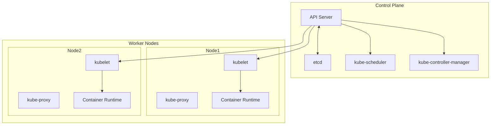
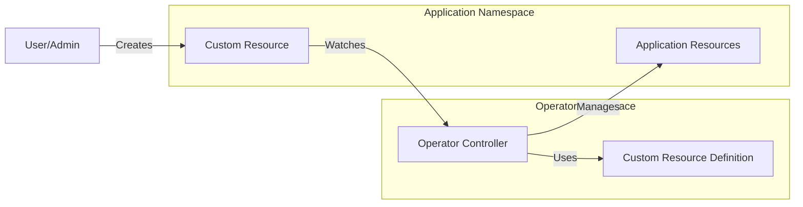

# Kubernetes Architecture and Components

## Cluster Architecture Diagram


## Custom Controller Architecture


## Cluster Components

### Control Plane Components
1. **kube-apiserver**
   - Exposes the Kubernetes API
   - Front-end for the control plane
   - Handles REST operations and validation

2. **etcd**
   - Consistent and highly-available key value store
   - Stores all cluster data
   - Backbone of the cluster state

3. **kube-scheduler**
   - Watches for newly created Pods with no assigned node
   - Selects a node for the Pod to run on
   - Considers resource requirements, hardware/software constraints, etc.

4. **kube-controller-manager**
   - Runs controller processes
   - Includes Node Controller, Replication Controller, Endpoints Controller, etc.
   - Each controller is a separate process but compiled into a single binary

### Node Components
1. **kubelet**
   - Agent that runs on each node
   - Ensures containers are running in a Pod
   - Takes PodSpecs and ensures containers are running and healthy

2. **kube-proxy**
   - Network proxy that runs on each node
   - Maintains network rules on nodes
   - Allows network communication to Pods

3. **Container Runtime**
   - Software responsible for running containers
   - Examples: containerd, CRI-O, Docker Engine

## Custom Controllers and Operators

### Where Custom Controllers Run
Custom controllers typically run as Pods in the cluster, usually in one of these locations:

1. **kube-system namespace**
   - For system-level controllers
   - Requires cluster-admin privileges
   - Example: cloud provider controllers

2. **Custom namespace**
   - For application-specific controllers
   - Example: `custom-controllers` or application-specific namespace
   - Requires appropriate RBAC permissions

### Operator Pattern
Operators are a method of packaging, deploying, and managing a Kubernetes application. They run as custom controllers and typically:

1. **Deployment Location**
   - Run in their own namespace (e.g., `operator-system`)
   - Deployed as a Deployment for high availability
   - Use leader election for multiple replicas

2. **Example Operator Deployment**
```yaml
apiVersion: apps/v1
kind: Deployment
metadata:
  name: my-operator
  namespace: operator-system
spec:
  replicas: 1
  selector:
    matchLabels:
      app: my-operator
  template:
    metadata:
      labels:
        app: my-operator
    spec:
      serviceAccountName: operator-sa
      containers:
      - name: operator
        image: my-operator:v1
```

3. **Key Characteristics**
   - Use Custom Resource Definitions (CRDs)
   - Implement control loops
   - Handle application lifecycle
   - Can be created using Operator SDK or Kubebuilder

### Controller Architecture
1. **Control Loop**
   - Watch for changes to resources
   - Compare desired state with current state
   - Take action to reconcile differences

2. **RBAC Requirements**
   - Need permissions to watch and modify resources
   - ServiceAccount with appropriate ClusterRoles
   - Example:
```yaml
apiVersion: rbac.authorization.k8s.io/v1
kind: ClusterRole
metadata:
  name: operator-role
rules:
- apiGroups: ["apps"]
  resources: ["deployments"]
  verbs: ["get", "list", "watch", "create", "update", "patch", "delete"]
```

3. **High Availability**
   - Deploy multiple replicas
   - Use leader election
   - Handle failover gracefully

## Best Practices for Custom Controllers
1. Use appropriate namespaces
2. Implement proper RBAC
3. Include health checks
4. Add metrics and logging
5. Handle graceful shutdown
6. Use leader election for HA
7. Implement proper error handling
8. Add comprehensive testing 