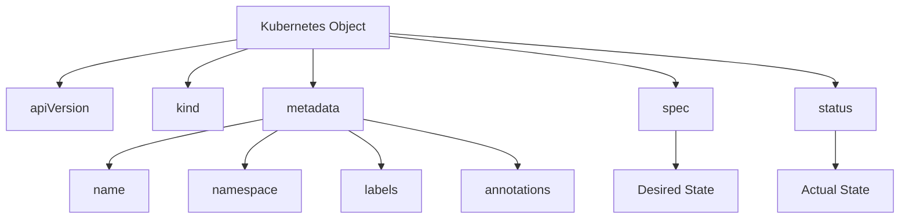

# Kubernetes Object Structure

## Object Fields Overview


## Core Object Fields

1. **apiVersion**
   - Defines the API group and version
   - Examples:
     ```yaml
     apiVersion: v1                    # Core API group
     apiVersion: apps/v1               # Apps API group
     apiVersion: batch/v1              # Batch API group
     apiVersion: networking.k8s.io/v1  # Networking API group
     ```

2. **kind**
   - Specifies the type of object
   - Common kinds:
     ```yaml
     kind: Pod
     kind: Deployment
     kind: Service
     kind: ConfigMap
     kind: ResourceQuota
     ```

3. **metadata**
   - Contains identifying information
   - Common fields:
     ```yaml
     metadata:
       name: my-pod                    # Unique identifier
       namespace: default              # Resource namespace
       labels:                         # Key-value pairs for selection
         app: nginx
         tier: frontend
       annotations:                    # Non-identifying metadata
         description: "Web server pod"
     ```

4. **spec**
   - Describes desired state
   - Varies by object type
   - Example (Pod):
     ```yaml
     spec:
       containers:
       - name: nginx
         image: nginx:1.14.2
         ports:
         - containerPort: 80
     ```

5. **status**
   - Reports actual state
   - Managed by the system
   - Example (Pod):
     ```yaml
     status:
       phase: Running
       conditions:
       - type: Ready
         status: "True"
       containerStatuses:
       - name: nginx
         ready: true
         restartCount: 0
     ```

## Object Lifecycle

1. **Creation**
   - User defines desired state in spec
   - System initializes status
   - Controllers begin reconciliation

2. **Update**
   - User modifies spec
   - System updates status
   - Controllers reconcile changes

3. **Deletion**
   - User requests deletion
   - System handles cleanup
   - Finalizers prevent premature deletion

## Common Object Types

1. **Workload Objects**
   ```yaml
   # Pod
   apiVersion: v1
   kind: Pod
   metadata:
     name: nginx
   spec:
     containers:
     - name: nginx
       image: nginx:1.14.2

   # Deployment
   apiVersion: apps/v1
   kind: Deployment
   metadata:
     name: nginx-deployment
   spec:
     replicas: 3
     selector:
       matchLabels:
         app: nginx
   ```

2. **Configuration Objects**
   ```yaml
   # ConfigMap
   apiVersion: v1
   kind: ConfigMap
   metadata:
     name: game-config
   data:
     game.properties: |
       enemies=aliens
       lives=3

   # Secret
   apiVersion: v1
   kind: Secret
   metadata:
     name: mysecret
   type: Opaque
   data:
     username: YWRtaW4=
     password: MWYyZDFlMmU2N2Rm
   ```

3. **Resource Management**
   ```yaml
   # ResourceQuota
   apiVersion: v1
   kind: ResourceQuota
   metadata:
     name: object-counts
   spec:
     hard:
       pods: "10"
       services: "5"
       secrets: "10"
   ``` 